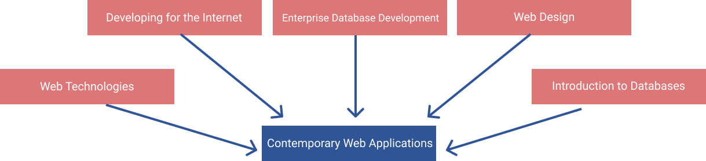

# Overview

> > The impact of COVID-19
> > All Modules on all courses within the Computing Subject Group will be delivered online in
> > Semester 1 2020-21, the campus will be open, but operating within COVID-19 guidelines.
> > For more information go to [https://www.solent.ac.uk/about/covid-19](https://www.solent.ac.uk/about/covid-19)

We are living in an increasingly interconnected digital world. As such, the complexities of managing and creating applications that operate in this domain become ever more complex. Workflows and techniques that may have been adequate a few years ago quickly become redundant. Web-application developers, to manage this ever-changing world, are adopting an agile approach to software development. Such an approach means quick iterations and a flexible development infrastructure that supports this process. The focus of this unit will be to explore how this process is managed. In doing so you will be exposed to work flows and modern development toolkits. Theory will be conceptualised and used on realistic projects that will be implemented to commercial production standards.

## Module Introduction

<iframe src="https://solent.cloud.panopto.eu/Panopto/Pages/Embed.aspx?id=3dc561f6-8c68-42ce-a9f0-ac32006b0fd8&autoplay=false&offerviewer=true&showtitle=true&showbrand=false&start=0&interactivity=all" height="405" width="720" style="border: 1px solid #464646;" allowfullscreen allow="autoplay"></iframe>

## Expectation for Engagement

For you to get the most out of online learning, you and your tutors each have specific roles to play.

**Tutors should:**

- regularly create and upload learning content for you to access independently
- create and be present in interactive activities such as quizzes, forums and blogs
- lead live group sessions where you can interact with peers and receive feedback
- give group and individualised feedback through forums, tutorials and individual written comments
- monitor your progress and adapt the focus of teaching to the needs of the group

**You should:**

- regularly visit module pages
- complete independent learning activities in the time specified
- prepare for, and attend live sessions
- ask questions through the channels specified, e.g. forums
- contribute to group activities, projects and discussions
- seek support from your tutors when you’re not sure what to do

## By the end of this Module you will be able to:

1. Break down a complex web-application into constituent parts and know how these parts interrelate to each other
2. Make judgments on the architecture of web-applications and understand the process of implementing and justifying this architecture
3. Reflect critically and constructively on web-based solutions that you have implemented.
4. Critique and reflect on your own work
5. Undertake research-based activities using a range of appropriate resources and methodologies to benchmark and evaluate the performance of web-applications.
6. Create usable and accessible applications that comply with current legal and professional guidelines

## You will be able to do this by taking part in the following activities:

- Online weekly practicals
- Independent study

## The Module Learning Journey

## Module Delivery

This module is delivered online in semester 1 consisting of 12 teaching weeks.

## Learning and Teaching Scheme

## Scheme Of Work

| Week | Topic                                       |
| :--: | ------------------------------------------- |
|  1   | The latest features of JavaScript           |
|  2   | React Fundamentals                          |
|  3   | Components and State management             |
|  4   | Styles in CSS                               |
|  5   | Testing and Deployment                      |
|  4   | Routing                                     |
|  5   | Forms and Validation                        |
|  6   | Advanced State Management                   |
|  7   | Firebase Authentication                     |
|  8   | Authenticated Routes                        |
|  9   | Managing Data In Firebase                   |
|  10  | Firebase Authentication and Cloud Functions |
|  12  | Assessment Checkin and Support              |
|  11  | Assessment Checkin and Support              |
