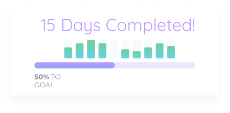

# Loop the Loop: Iterating over data structures

This week we are considering the following question:

**How might we iterate over data structures and display them in the DOM?**

::: tip Session Dependencies

**Prior to starting the session you should clone the latest version of the ongoing project:**

`git clone -b week-2-solutions https://github.com/joeappleton18/running-contemp-web-app-solutions.git`

- Open the project in VS code, `code running-contemp-web-app-solutions`
- Install the dependencies, `npm install`
- You can then start the application, `npm run start`

From this week forward, we are incrementally going to be working on our goal tracking application. [You can view the mockup here](https://www.figma.com/file/rTbqRpRWOw7UYg28SBcxQv/web-dev-pratical-task-made-using-toxin-ui?node-id=31262%3A3).

:::

By the end of the session, you should:

- Know how to iterate over lists and display your data in the DOM
- Understand how JSX facilitates displaying lists

## Why do we need to iterate over data structures?

Typically, front end applications receive data from the back-end in a list format.  In the context of Web Development, this list will take the form of JSON array:

```json
[
  {
    "name": "Joe",
    "location": "Brighton"
  },
  {
    "name": "Martin",
    "location": "Bournemouth"
  }
]
```

> > An example JSON object

You should be familiar with JSON. It's simply a way to represent data. As you can see, it is very similar to JavaScript. In fact, it's easy to process JSON:

```javascript
const obj = JSON.parse(
  '[{"name": "Joe","location": "Brighton"},{"name": "Martin","location": "Bournemouth"}]'
);
console.log(obj);

/*Prints to the console:
  [ { name: 'Joe', location: 'Brighton' },
  { name: 'Martin', location: 'Bournemouth' } ]
 */
```

>> An example of converting a JSON object to an array of JavaScript object literals

### Displaying lists in React

Often you will have to iterate over some data structures, like the one above, to construct your React views, this is very easy to achieve in JSX.

```js
....
const numbers = [1, 2, 3, 4, 5];
return  const listItems = numbers.map((number) => (
  <li key={number.toString()}>{number}</li>
));
....
```

[We can simply use an array map function (see above) to render array structured data into our views](https://developer.mozilla.org/en-US/docs/Web/JavaScript/Reference/Global_Objects/Array/map). Notice how we are embedding pure JavaScript into our views.

## A Real World Example

Let's revisit what our completed `DaysCompleted` component should look like:



To add further context, each histogram bar represents a percentage score from the last 10 days. As you can imagine, this information will be receive from an external data source. However, we don't really know what that is going to look like yet. Until this is the case, we will have to mock our data.

:::warning Tip

You can use technique if you are trying to mock functionality that is too complex to implement for your final assessment.

Commonly, several components will need to reflect changes in data. Remember, data in a React application flows one-way, from parent to child. As such, it is common practice to lift the state to a top-level component (e.g. App.js).

:::

## Video walk-through of task 1 and 2

<iframe src="https://solent.cloud.panopto.eu/Panopto/Pages/Embed.aspx?id=9c4cd22e-f40f-402b-866c-adbe00ee2e57&autoplay=false&offerviewer=true&showtitle=true&showbrand=false&captions=true&interactivity=all" height="405" width="720" style="border: 1px solid #464646;" allowfullscreen allow="autoplay"></iframe>

::: tip Task 1

## Task 1 Mocking Data :rocket:

Let's create a data structure that contains check-in scores out of 20. Within App.js, create the following data structure:

```js
const checkins = [
  {
    date: "Wed Jan 29 2020 07:17:11 GMT+0000 (Greenwich Mean Time)",
    score: 20,
  },
  {
    date: "Wed Jan 28 2020 07:17:11 GMT+0000 (Greenwich Mean Time)",
    score: 15,
  },
  { date: "Wed Jan 27 2020 07:17:11 GMT+0000 (Greenwich Mean Time)", score: 8 },
  { date: "Wed Jan 26 2020 07:17:11 GMT+0000 (Greenwich Mean Time)", score: 2 },
  {
    date: "Wed Jan 25 2020 07:17:11 GMT+0000 (Greenwich Mean Time)",
    score: 20,
  },
  {
    date: "Wed Jan 23 2020 07:17:11 GMT+0000 (Greenwich Mean Time)",
    score: 12,
  },
  {
    date: "Wed Jan 22 2020 07:17:11 GMT+0000 (Greenwich Mean Time)",
    score: 19,
  },
  {
    date: "Wed Jan 21 2020 07:17:11 GMT+0000 (Greenwich Mean Time)",
    score: 10,
  },
  {
    date: "Wed Jan 20 2020 07:17:11 GMT+0000 (Greenwich Mean Time)",
    score: 15,
  },
  { date: "Wed Jan 19 2020 07:17:11 GMT+0000 (Greenwich Mean Time)", score: 6 },
  {
    date: "Wed Jan 18 2020 07:17:11 GMT+0000 (Greenwich Mean Time)",
    score: 20,
  },
  {
    date: "Wed Jan 17 2020 07:17:11 GMT+0000 (Greenwich Mean Time)",
    score: 20,
  },
  {
    date: "Wed Jan 16 2020 07:17:11 GMT+0000 (Greenwich Mean Time)",
    score: 20,
  },
  {
    date: "Wed Jan 15 2020 07:17:11 GMT+0000 (Greenwich Mean Time)",
    score: 20,
  },
];
```

:::

:::tip Task 2

## Task 2 Completing `DaysCompleted` component :rocket:

- I have started the histogram component for you (`/Components/Histogram.js`) - complete it! Data should feed into `DaysCompleted` first.

- Finally, create the progress bar. To do this you will need to create and use a new component called `ProgressBar`

- This part of our application should meet the following user stories:

- As a user, I should be able to view how many days have been completed in text and as a percentage, so I know how close to my goal I am
- As a user, I should be able to view a histogram of, up to, my last 10 check-ins, so I can track my progress as a daily percentage out of 20

:::

::: Tip task 4

## Task 4 - Start to think about your project

Start to consider the project that you are going to be completing for the final assessment. [If you have an idea you can submit an ethics application](https://ethics.app.solent.ac.uk/)

:::
