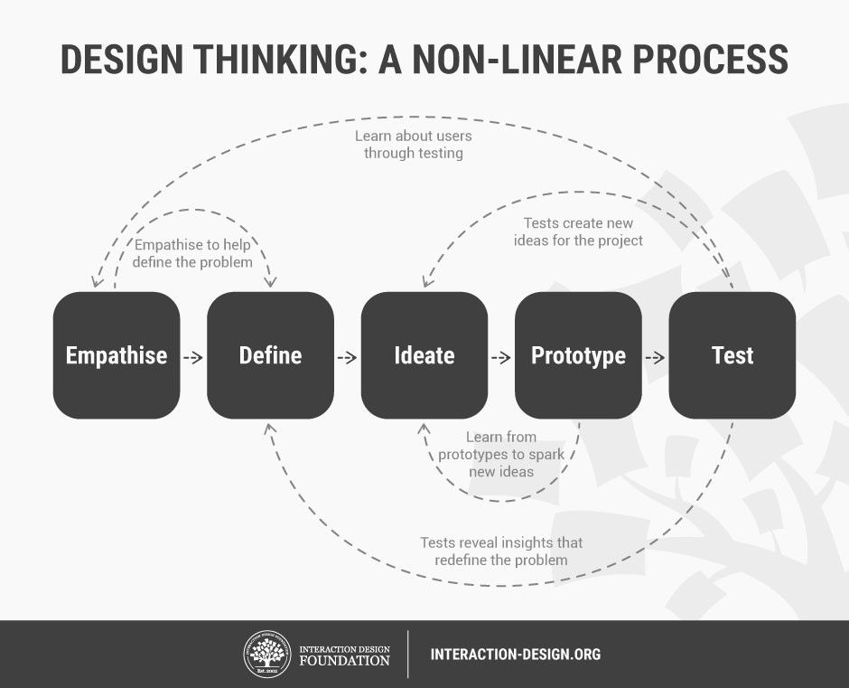

# Design Thinking Workshop

This week we are going to consider the ideas surrounding design thinking. By the end of this session you should be able to answer:

- What is design thinking?
- How can I incorporate design thinking into my design process?

## What is design thinking

The term "design thinking" is not new, popularised by the title of a book written by Rowe in 1987 (Rowe, 1987). Design thinking is a method to solve ill-structured people focused problems. People focused is key; in-fact, we cannot engage in design thinking without gaining a deep understanding surrounding the people we are designing for.

[According to the Interaction Design Foundation: "Design Thinking helps us in the process of questioning: questioning the problem, questioning the assumptions, and questioning the implications."](https://www.interaction-design.org/literature/article/what-is-design-thinking-and-why-is-it-so-popular).

## How does design thinking work?

Design thinking is not recipe; rather, it offers broad guidance on how to approach a problem in a way an experienced designer would. The guidance consists of 5 phases, and below I have framed this guidance in the context of developing an application to solve a problem.

- **Empathise**, Understand your potential users
- **Define**, Through the inter-subjective experiences of your users define the problem
- **Ideate**, Consider potential solutions
- **Prototype**, Implement enough functionality to test your solution
- **Test**, Evaluate your solution with users

It's worth noting that the above phases are not sequential, and the process can be treated a iterative. However, for a small university project you would normally only complete a single iteration.

## Design thinking workshop

We are going to be working together to solve the problem of:

**How might we encourage students to recycle more?**

## 1. Empathise (0 - 20 minutes)

In your groups, discuss why you might not recycle, and scribble down some possible reasons.

## 2. Define (20 - 40 mins)

Can you use what you learnt from the previous task to define a reason or multiple reasons, preventing students from recycling.

## 3. **Ideate** . (50 - 70 mins)

Consider potential solutions. Design a wire frame or mock up to showcase your solution.

This is as far as we will get; hopefully, you are starting to understand the process.
