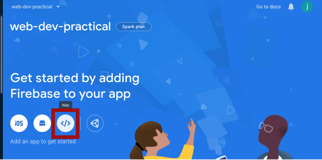
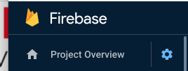
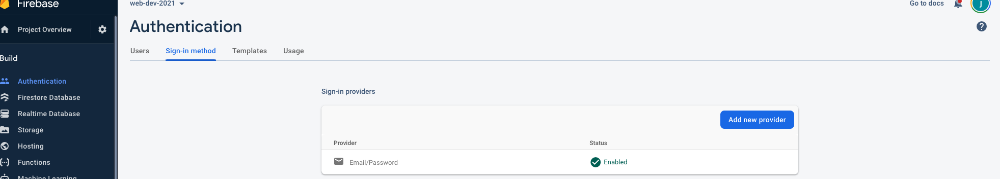

# Week 8 - Firebase Authentication and Custom Hooks

This week, for me, is the most exciting session to deliver. I going to be introducing you to the wonderful, time and cost saving world, of serverless systems. In doing so, we are going to be using a authentication service offered by Firebase . This will allow users to sign up and log into our application. Crucially, we will now be able to lock sections of our application down. We'll be answering the following question:

**How can I authenticate my react applications allowing users to sign in using a range of different methods (facebook, email, gmail)?**

:::warning session dependencies

## Session Dependencies

[Make sure that you have the latest of the ongoing class, fitness tracker, project. **The notes for this week refer extensively to this project**](`git clone -b week-7-solutions https://github.com/joeappleton18/running-contemp-web-app-solutions.git`)
:::

### Essential Reading :closed_book:

:::warning essential reading

[Creating React Hooks Custom Hooks](https://reactjs.org/docs/hooks-custom.html#using-a-custom-hook)

[Firebase Authentication](https://firebase.google.com/docs/auth/web/start)

:::

## Firebase

[Firebase](https://firebase.google.com/docs) is a cloud infrastructure service that was acquired by Google in 2015 - it effectively is a sub-product suite of the [cloud platform](https://cloud.google.com/). At the time of writing, Firebase offers a range of web-enabled services, the most popular being:

- Authentication
- The Cloud Firestore Database
- Cloud Functions
- Hosting

Firebase, and other infrastructure as a service platform, delegate the need to manage infrastructure away from the developer. This is particularly appealing if you are working in a small team, or, as a solo developer. What's more, for our use, it has a very generous free tier.

## Getting Started

:::tip task

## Task 1 - Setting Up Firebase

The purpose of this task is simply to set up a firebase account, create a project and register your first application - it is much easier than it sounds.

1. [Create a Firebase Account ](https://firebase.google.com/)

2. Next, create a project and name it whatever you like



3. Within your project, register a new web application, register a new web application, also name it what you like

4. Finally, within our weekly web project, install the firebase library by running: `npm install firebase`

:::

## Setting Up Third Party Services in React

Remember, React is just a light layer of UI functionality sprinkled on top of JavaScript. As such, we can structure our apps in the way we want - this is both a blessing and a curse. While we have free range on our app's architecture, things can get messy - very quickly. This is why we need to be strict on enforcing conventions (e.g. component names must have uppercase first letter). It keeps things sane as our app grows. With this in mind, I like to create, what I refer to as services to handle interactions with third-party apis/services such as firebase.

### Setting Up a Firebase Service

Before we can set up our firebase service we need to export a configuration object that identifies our firebase project.

:::tip

## Task 2 - Setting Up a Firebase Config File

- Create the file `src/config/firebase.js`

  

- Next, access your firebase project settings by clicking on the cog on the top left of the project area Scroll down and find your apps specific configuration object.

- Finally, place it `src/config/firebase.js` as a `const` and export it. Here is what mine looks like:

```JavaScript
const firebaseConfig = {
    apiKey: "xxxxxxxxxxxxxxxxxxxxxxxxxxxxxxxxxxxx",
    authDomain: "web-dev-practical.firebaseapp.com",
    databaseURL: "https://web-dev-practical.firebaseio.com",
    projectId: "web-dev-practical",
    storageBucket: "web-dev-practical.appspot.com",
    messagingSenderId: "1030945380946",
    appId: "1:1030945380946:web:ae1bca104338f617df9d8b",
    measurementId: "G-321SW2SPSG"
};

export default firebaseConfig;
```

:::

## Creating Custom Hooks

You have already seen and used Hooks; according to the React documentation:

> > [_Hooks_ are a new addition in React 16.8. They let you use state and other React features without writing a class](https://reactjs.org/docs/hooks-custom.html#using-a-custom-hook).

React Hooks such as useSate and useEffect allow us to share logic between components without the need to write a class. Along this line of thinking, creating our own custom hooks can allow us to share logic that we have created - perfect for capturing third party service communication.

:::tip

## Task 3 - Creating a Custom Hook

According to React:

> > [**A custom Hook is a JavaScript function whose name starts with ”use” and that may call other Hooks**](https://reactjs.org/docs/hooks-custom.html#using-a-custom-hook)

Let's create a hook that handles firebase authentication.

- Following the above naming convention, create the file: `src/services/firebase/useAuth.js`
- Add the following code:

```javascript
import { useState } from "react";
function useAuth() {
  const [isAuthenticated, setIsAuthenticated] = useState(false);
  return { isAuthenticated };
}
export default useAuth;
```

- That's it, you've just created your first hook. It's small at the moment, we'll flesh it out later

- Let's consider what we are doing above.

  - You should already know that we are setting the state `isAuthenticated` to a default value of false: `const [isAuthenticated, setIsAuthenticated] = useState(false);`
  - You may, however, not know exactly what `return {isAuthenticated};` is. It is not JSX, remember a hook is essentially a function, [I am simply using shorthand property names](https://alligator.io/js/object-property-shorthand-es6/) to return an object. `{isAuthenticated}` is the same as {isAuthenticated : isAuthenticated }

- Let's use the hook

  - First, import it into `src/App.js` - `import useAuth from "./services/firebase/useAuth";`

  - We can then use object destructuring to invoke the function and grab the `isAuthenticated` state

    ```javascript
    function App() {
      ....
      const { isAuthenticated } = useAuth();
      ....
    ```

:::

How might we use the above hook? All it currently does is return to us that a given user is not authenticated. This, however, is all we need to lock down routes that are only accessible to logged-in users. To achieve this, we need to consider how to set up protected routes. A protected route will redirect to the login page if a user is not logged in. [The React Router Documentation suggests that we can create the following wrapper component to protect routes](https://reacttraining.com/react-router/web/example/auth-workflow)

```jsx
function Protected({ authenticated, children, ...rest }) {
  return (
    <Route
      {...rest}
      render={({ location }) =>
        authenticated ? (
          children
        ) : (
          <Redirect
            to={{
              pathname: "/login",
              state: { from: location },
            }}
          />
        )
      }
    />
  );
}
```

- After pasting in the above code you will need to make sure that you import the redirect component at the top of App.js - `import { Switch, Route, useLocation, Redirect } from "react-router-dom";`

- The above component is similar to our `src/Tile.js` component, in that it wraps around some child component. However, it has a bit more logic, can you see how it is checking if authenticated is true? If this is the case the wrapped component is rendered, if not, we redirect to login. The router uses render props to achieve this, like hooks, render props are used to share logic. Once the above component is set up we can wrap it around our protected routes:

```jsx
<Protected authenticated={isAuthenticated} exact path="/">
  <Dash checkins={checkins} />
</Protected>
```

:::tip

## Task 4 - Locking Down our Application

Using the notes above, lock your application down. Login and Sign up should be the only accessible pages for unauthenticated users

::::

## Integrating a hook with Firebase

Setting up firebase in our project is fairly straightforward. First, we need to import our dependencies, usually, you would do this in the highest level component `src/App.js`:

```javascript
...
import { initializeApp } from "firebase/app";
import firebaseConfig from "./config/firebaseConfig";
...
```

- Above, we have imported firebase services surrounding authentication and the ability to support a email sign up flow.

- Next, at the top of our `App` component, we can initiate firebase:

```javascript
function App() {
  ...
    const app = initializeApp(firebaseConfig);
    const { isAuthenticated } = useAuth();
  ...
}
```

- That's it, you should now have access to the firebase suite of products in your application! **Note, make sure you *

:::tip

## Task 5 - Initiate Firebase

Using the techniques above, initiate firebase in your application

::::

## Using Firebase Auth

## Sign up new users



Ok, so we are now ready to authenticate users. To begin, we will focus on setting up an email login flow. However, firebase supports over a dozen different sign up flows.

The first thing we need to do is enable an authentication method within our firebase project. First, within your firebase console, simply click authentication in the side menu and enable email authentication. That's it! We are now ready to authenticate and register users in our application.

Now we are ready to start building out our `/services/firebase/useAuth.js` hook. The first thing we need to do is import the necessary libraries from `firebase/auth` to allow an email flow. At the top of `/services/firebase/useAuth.js` add the following code:

```JavaScript

....
import {
  getAuth,
  onAuthStateChanged,
  signInWithEmailAndPassword,
  createUserWithEmailAndPassword,
  signOut,
} from "firebase/auth";
...
```

- Notice how granular the parts of the library are! This is a relatively new update, and it means our overall builds are smaller. Update your `useAuth` hook so it resembles the following:

```JavaScript

function useAuth() {
	const [isAuthenticated, setIsAuthenticated] = useState(false);
	const auth = getAuth();

	useEffect(() => {
	  
		onAuthStateChanged(auth, (user) => {
			if (user) {
				console.log(user);
				setIsAuthenticated(true);
				return;
			}
			setIsAuthenticated(false);
			console.log("auth called");
			return;
		});
	  
	}, [setIsAuthenticated, auth])
	
	

	const createEmailUser = (email, password) =>
		createUserWithEmailAndPassword(auth, email, password);

	const signInEmailUser = (email, password) =>
		signInWithEmailAndPassword(auth, email, password);

	const signUserOut = () => signOut(auth);

	return { createEmailUser, isAuthenticated, signInEmailUser, signUserOut };
}

export default useAuth;
```

- Above, I am initiating a new authentication object, `const auth = getAuth();`. Notice how this newly minted `auth` object is then passed into each further auth method.
- Next, I am using `onAuthStateChanged` to set up a listener that is called when a user authentication event occurs. Notice how I toggle the is authenticated state based on the `user` being set. I have placed this in a `useEffect` function so it only runs once. 
- Next, observe how `createEmailUser`, `signInEmailUser` and `signUserOut` are wrappers around our firebase functions. This allows us a little more control.
- Finally, I am returning the methods to expose them to the wider application `return { createEmailUser, isAuthenticated, signInEmailUser, signUserOut };`
- That's it we are ready to go, and authenticate a user!

### Authenticating Users

- Let's consider how we might sign up a user!
- First, within `src/Views/Join.js` import our `useAuth` hook

```JavaScript
import useAuth from "../services/firebase/useAuth";
```

- Next we need to initiate it, and pull out the `signInEmailUser` method. In `src/Views/Join.js`'s `Join` add the following:

```JavaScript
function Join(props) {
    const { createEmailUser } = useAuth();
 ...
```

- Now we want to create a submission handler and attach this to the email submission event. We also need to create some state to handle an error

```JavaScript
function Join(props) {
   const [severErrorMessage, setServerErrorMessage] = useState("");
   ...
   const handleEmailSubmit = async (data) => {
    try {
      const { email, password } = data;
      await createEmailUser(email, password);
    } catch (e) {
      setServerErrorMessage(e.message);
    }
  };
   ...

   <Form
          onEmailSubmit={handleEmailSubmit}
          serverErrorMessage={severErrorMessage}
   />
```

**Note:** you'll need to update your form component so it can display the server error`.

- You should now be able to create a new user, if you check your authentication tab in firebase you should see them in there.

::: tip

## Task 6 Allow Users to Sign In

- Follow the above steps to allow users to sign up to your application?
- Can you also use the same pattern to allow users to login?

We have a slight issue! Notice when you visit dash, your application at this stage will be authenticating however we still get redirected to the login page when we try and visit our root url. This is because our redirect fires before our application authenticates. In order to fix this we need a `useEffect` hook that listens to our `isAuthenticated` state and redirects the user to the dash when it changes to true. We can achieve this through adding the following function to our `App.js` - `App()` function:

```javaScript
import { Switch, Route, useLocation, Redirect, useHistory } from "react-router-dom";

function App() {
const history = useHistory();
 ...

 useEffect(() => {
    if (isAuthenticated) {
      history.push('/');
      return;
    }
    return;
  }, [isAuthenticated])

 ...

}
```

:::

::: tip

## Task 7 - Complete the Authentication

Complete the authentication workflow and see if you can work out how to log a user out.

:::

## Further Study

:::tip further study

## Task 8 - Increasing the functionality

- Can you work out how to add the signed in user details to a user state in our useAuthHook. Next, share this around the application so the user name and an avatar or placeholder avatar (if there is not one) appear in the header.

- Can you use use [react notifications](https://www.npmjs.com/package/react-notifications) to provide better user feedback (inform them when they have logged in or out)
- Can you, in a similar way we did for protected routes, redirect the user to dash if they are logged in and navigate to the join or login page

## Task 9 - Add social sign in

- Set up social sign in methods (Facebook and Gmail)

:::


## Solution Video 

Below is a video walking you through the solutions for task 7, 8 and 9. Before starting this tutorial, I recommend that you clone the week-8 part solution and use this as your starting point. Simply run the following command:

`git clone -b week-8-part-solution https://github.com/joeappleton18/running-contemp-web-app-solutions.git`

Next, ensure you follow the README.md to connect the project to firebase.

<iframe src="https://solent.cloud.panopto.eu/Panopto/Pages/Embed.aspx?id=4961360b-67f9-4e48-9860-ade500bc6924&autoplay=false&offerviewer=true&showtitle=true&showbrand=false&captions=true&interactivity=all" height="405" width="720" style="border: 1px solid #464646;" allowfullscreen allow="autoplay"></iframe>
